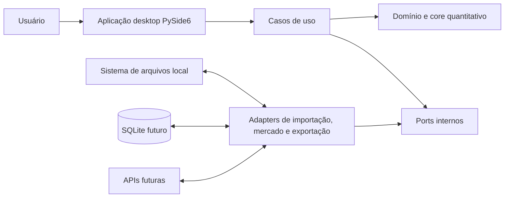

# Visão geral da arquitetura

## Estado

- **Versão do documento:** 0.1
- **Data:** 2026-07-13
- **Estado:** arquitetura inicial proposta para evolução incremental
- **Escopo:** limites, responsabilidades, dependências e estrutura-alvo

## Objetivos arquiteturais

A arquitetura do Zeus Risk Engine deve favorecer, nesta ordem:

1. correção e verificabilidade dos cálculos;
2. separação entre domínio quantitativo e tecnologias de apresentação;
3. rastreabilidade de entradas, parâmetros, resultados e problemas;
4. evolução incremental sem criar componentes vazios ou prematuros;
5. usabilidade em desktop e responsividade em operações demoradas;
6. substituição de fontes de dados e persistência por contratos explícitos.

## Restrições conhecidas

- aplicação desktop em Python com PySide6;
- funcionamento básico sem internet;
- pacote planejado `zeus_risk` no layout `src`;
- primeira versão local e monousuário;
- dados de mercado inicialmente carregados de arquivos;
- testes do núcleo não podem exigir ambiente gráfico;
- nenhuma fórmula financeira em widgets, views ou controladores Qt.

## Estilo arquitetural

O produto será um **monólito modular desktop**, organizado em camadas e com ports
and adapters nas fronteiras externas. Isso mantém implantação e depuração simples
no início, sem acoplar o domínio a arquivos, banco de dados, APIs ou Qt.

“Monólito” descreve a unidade de distribuição, não um arquivo único. Os módulos
internos continuam com contratos e responsabilidades separados. Processos ou
microserviços só seriam considerados diante de uma necessidade concreta que não
existe no escopo atual.

## Contexto do sistema



O diagrama representa dependências lógicas. Dados podem fluir nos dois sentidos
por objetos de entrada e resultado, mas dependência de código continua orientada
para dentro: implementações tecnológicas conhecem contratos internos; o core não
conhece PySide6, SQLite ou uma API específica.

## Regra de dependência

```text
app/PySide6  ──>  application  ──>  domain + core
                         ^                ^
                         │                │
infrastructure/adapters ─┴────────────────┘
```

- `domain` e `core` usam apenas a biblioteca padrão e dependências quantitativas
  justificadas para sua função, nunca Qt.
- `application` coordena casos de uso e depende de modelos internos e ports.
- `app` converte eventos de UI em comandos de aplicação e renderiza resultados.
- `infrastructure`, `importers`, `market_data`, `repositories` e `exporters`
  implementam contratos definidos pelo lado consumidor.
- o ponto de composição cria implementações e as injeta; módulos internos não
  procuram dependências em variáveis globais.

Essa decisão é formalizada no
[ADR-001](../decisions/ADR-001-separation-of-ui-and-core.md).

## Responsabilidades por camada

| Área | Responsabilidade | Não deve conter |
|---|---|---|
| `domain` | entidades, objetos de valor, enums, invariantes e problemas estruturados | Qt, leitura de arquivos, SQL, fórmulas de apresentação |
| `core` | regras de carteira, analytics e modelos quantitativos puros | widgets, diálogos, caminhos globais, persistência |
| `application` | casos de uso, orquestração, ports, políticas de fluxo e DTOs de fronteira | fórmulas financeiras, SQL, detalhes visuais |
| `importers` | leitura, normalização e tradução de formatos de carteira | decisão de habilitar botões ou renderização |
| `market_data` | providers, alinhamento, cache e metadados de séries | regras da interface |
| `repositories` | implementações de persistência futura | regra quantitativa |
| `exporters` | transformação de resultados estruturados em formatos externos | recálculo de métricas |
| `infrastructure` | logging, relógio, IDs, hashing e composição tecnológica | regra de domínio |
| `app` | views, widgets, controllers, workers e recursos PySide6 | validações duplicadas e cálculos financeiros |

Pastas serão criadas quando tiverem uma responsabilidade implementada. A tabela
define limites futuros, não exige esqueletos vazios na Fase 0.

## Componentes planejados

### Domínio de carteira

A Fase 2 entrega `Currency`, `Instrument`, `Position`, `Portfolio` e
`ValidationIssue`. Objetos de valor validam invariantes locais; validações que
dependem de várias linhas ou fontes ficam em serviços explícitos. Composição e
dataclasses imutáveis são preferíveis a hierarquias profundas. Valores de moedas
diferentes não são agregados sem conversão explícita, conforme o
[ADR-003](../decisions/ADR-003-decimal-and-portfolio-weights.md).

### Importação

Um importador transforma conteúdo externo em um `ImportResult`, preservando
linhas, valores originais relevantes e problemas. A leitura de CSV/XLSX é um
detalhe de adapter; a validação de uma posição pertence ao domínio ou a um
serviço de validação reutilizável.

### Dados de mercado

Um `MarketDataProvider` será um `Protocol` ou ABC pequeno, definido a partir das
necessidades do caso de uso. Ele retorna `PriceSeries` e `MarketDataMetadata` ou
uma falha específica. Providers locais, de demonstração, de cache e APIs futuras
podem cumprir o mesmo contrato.

### Analytics e risco

Funções ou serviços puros recebem objetos validados e devolvem resultados
tipados. Cada modelo documenta fórmula, parâmetros, hipóteses, interpretação,
limitações, casos-limite e estratégia de teste. Uma interface comum de modelos só
será extraída quando ao menos dois modelos reais demonstrarem a abstração.

### Aplicação

Cada fluxo importante terá um caso de uso explícito, por exemplo
`ImportPortfolio`, `LoadMarketData` e `RunRiskAnalysis`. O caso de uso coordena
ports, captura apenas exceções que sabe traduzir e retorna um resultado adequado
à fronteira sem importar PySide6.

### Desktop

Views exibem estado; controllers ou presenters ligam sinais a casos de uso;
models Qt adaptam coleções para tabelas; workers executam tarefas longas. A
interface nunca recalcula um resultado recebido. A adoção de PySide6 está
registrada no [ADR-002](../decisions/ADR-002-use-of-pyside6.md).

## Fluxo de dados principal

1. A view coleta um caminho e envia um comando ao caso de uso.
2. O caso de uso chama o adapter de importação.
3. O adapter converte dados externos e aciona validações reutilizáveis.
4. O caso de uso recebe `ImportResult` e o devolve à apresentação.
5. Depois da confirmação, outro caso de uso solicita séries ao
   `MarketDataProvider`.
6. Séries e metadados são validados e alinhados por política explícita.
7. O caso de análise chama o core quantitativo com carteira, séries e
   configuração validadas.
8. O core retorna objetos de resultado sem conhecer tela, arquivo ou banco.
9. A apresentação renderiza; exporters e repositories recebem o mesmo resultado
   estruturado sem recalculá-lo.

## Contratos de dados planejados

| Contrato | Papel |
|---|---|
| `Instrument` | identidade e classificações do instrumento |
| `Position` | instrumento, quantidade e preço de referência |
| `Portfolio` | conjunto validado de posições e metadados da carteira |
| `PriceSeries` | observações temporais de um ativo com invariantes conhecidas |
| `MarketDataMetadata` | origem, frequência, intervalo e tratamento dos dados |
| `RiskConfiguration` | parâmetros validados e compatíveis com um schema |
| `ValidationIssue` | severidade, código, mensagem e localização de um problema |
| `ImportResult` | linhas/posições, problemas e resumo da importação |
| `RiskResult` | métrica, valor, unidade, modelo, parâmetros e problemas |
| `ExecutionRecord` | evidência reproduzível de uma execução futura |

Os contratos de carteira foram concretizados na Fase 2; os demais continuam como
vocabulário inicial e só devem incluir campos usados por casos de uso reais.

## Validação e tratamento de falhas

Validação esperada é dado de negócio, não exceção de controle. Problemas
recuperáveis são representados por `ValidationIssue` com:

- severidade `info`, `warning` ou `error`;
- código estável;
- mensagem compreensível;
- campo, item e localização quando aplicáveis;
- contexto técnico opcional que não exponha informação sensível.

Exceções específicas representam operações que não puderam produzir seu
contrato, como `PortfolioImportError`, `InsufficientDataError` ou
`RiskCalculationError`. As fronteiras traduzem exceções sem apagar causa e
registram diagnóstico. Não haverá `except Exception` silencioso.

## Processamento assíncrono

Assincronismo é uma preocupação de aplicação/apresentação, não do cálculo. Na
fase apropriada:

- workers executarão casos de uso síncronos e testáveis fora da thread da UI;
- progresso será emitido por unidades de trabalho conhecidas;
- cancelamento será cooperativo por token ou callback, em pontos seguros;
- cancelamento, falha e sucesso serão estados distintos;
- widgets não serão acessados diretamente pela thread de trabalho;
- encerramento aguardará ou cancelará workers de forma controlada.

Essa abordagem evita contaminar o core com tipos Qt e mantém a opção de executar
o mesmo caso de uso em CLI ou teste.

## Persistência, configuração e cache

- **Fase inicial:** arquivos locais e objetos em memória.
- **Configurações:** JSON com `schema_version`, validação e migrações explícitas
  quando necessário.
- **Cache de mercado:** conteúdo endereçável por fonte, ativo, intervalo e
  política; metadados preservam obtenção e integridade.
- **Persistência posterior:** SQLite atrás de repositories, com transações e
  migrações versionadas.
- **Execuções:** registro futuro inclui versão, data, carteira, fonte, intervalo,
  modelo, parâmetros, avisos, erros, duração, hash e resultados.

Nenhum repository ou banco será criado antes de existir caso de uso persistente
e schema revisado.

## Reprodutibilidade numérica

- entradas externas são validadas antes do cálculo;
- ordem, alinhamento de datas e política de missing values são determinísticos;
- configurações efetivas acompanham resultados;
- seeds são obrigatórias nos testes de simulação;
- tolerâncias usam `pytest.approx` ou equivalente com justificativa;
- arredondamento é responsabilidade de apresentação/exportação, salvo quando a
  própria regra do domínio o exigir;
- datasets de regressão serão pequenos, licenciáveis e verificáveis manualmente;
- versão de algoritmo ou schema será registrada quando necessária para comparar
  execuções.

## Segurança e privacidade no escopo local

O produto não terá autenticação na primeira versão, mas ainda deve:

- nunca incluir credenciais, tokens ou dados confidenciais nos exemplos;
- evitar registrar o conteúdo integral de carteiras por padrão em logs;
- tratar caminhos e fórmulas de planilhas como entrada não confiável;
- validar destinos de escrita e não sobrescrever arquivos sem confirmação;
- documentar riscos de CSV injection antes de exportar conteúdo fornecido pelo
  usuário;
- não interpretar arquivos importados como código.

## Estratégia de testes

| Nível | Foco | Dependências externas |
|---|---|---|
| unitário | invariantes, validações e fórmulas | nenhuma; dados sintéticos |
| propriedade | invariantes numéricas gerais | seeds fixas quando aleatório |
| regressão numérica | resultados de referência | fixtures versionadas |
| integração | importação, provider, configuração, persistência e exportação | arquivos temporários locais |
| GUI | modelos, estados e fluxos críticos | Qt em modo apropriado ao CI |
| end-to-end | caminho mínimo do usuário | projeto de exemplo local |

Testes do core serão majoritários. Testes GUI cobrem coordenação e apresentação,
sem repetir todas as combinações quantitativas.

## Atributos de qualidade verificáveis

- **Independência:** importar e testar `zeus_risk.domain` e `zeus_risk.core` não
  importa módulos Qt.
- **Reprodução:** a mesma fixture, configuração e versão produz o mesmo resultado
  dentro da tolerância declarada.
- **Resiliência de entrada:** uma linha inválida não impede o relatório das demais.
- **Responsividade:** uma tarefa designada como longa não bloqueia o event loop e
  pode ser cancelada com estado consistente.
- **Auditabilidade:** uma exportação ou execução identifica parâmetros, versão,
  fonte, período e problemas relevantes.
- **Extensibilidade:** um provider local alternativo pode ser adicionado sem
  modificar o core quantitativo.

## Estrutura inicial proposta do repositório

```text
zeus-risk-engine/
├── assets/
│   ├── icons/                 # criados quando a UI tiver recursos reais
│   └── samples/               # dados sintéticos versionados
├── docs/
│   ├── architecture/
│   │   └── overview.md
│   ├── concepts/              # fórmulas e interpretação, a partir da Fase 6
│   ├── decisions/
│   │   ├── ADR-001-separation-of-ui-and-core.md
│   │   ├── ADR-002-use-of-pyside6.md
│   │   └── ADR-003-decimal-and-portfolio-weights.md
│   ├── development/
│   │   └── roadmap.md
│   ├── models/
│   │   └── portfolio-domain.md
│   ├── tutorials/             # fluxos executáveis quando existirem
│   ├── glossary.md
│   ├── product-vision.md
│   ├── scope.md
│   └── use-cases.md
├── examples/                  # exemplos executáveis, não duplicação de testes
├── scripts/                   # automações repetíveis do projeto
├── src/
│   └── zeus_risk/
│       ├── application/       # casos de uso e ports
│       ├── app/               # integração PySide6
│       │   ├── controllers/
│       │   ├── views/
│       │   ├── widgets/
│       │   └── workers/
│       ├── config/
│       ├── core/
│       │   ├── analytics/
│       │   ├── backtesting/
│       │   ├── portfolio/
│       │   ├── risk/
│       │   └── stress/
│       ├── domain/
│       ├── exceptions/
│       ├── exporters/
│       ├── importers/
│       ├── infrastructure/
│       ├── market_data/
│       └── repositories/
├── tests/
│   ├── fixtures/
│   ├── gui/
│   ├── integration/
│   ├── regression/
│   └── unit/
├── .github/workflows/         # adicionado com a primeira pipeline
├── .gitignore
├── CHANGELOG.md
├── CONTRIBUTING.md
├── LICENSE
├── README.md
└── pyproject.toml
```

### Política de criação incremental

Até a Fase 2 foram criados a fundação executável e o domínio de carteira. Cada
subpacote de `core`, adapter, pasta de teste ou asset futuro só será criado com seu
primeiro conteúdo real. Isso evita estrutura ornamental e torna cada mudança
explicável.

## Decisões ainda necessárias

- ADR sobre conversão para moeda-base e fontes de câmbio;
- ADR sobre convenção de sinal de VaR e Expected Shortfall;
- ADR sobre política de datas e missing values;
- ADR sobre persistência SQLite e migrações;
- decisão sobre contratos de importação e preservação da linha original;
- decisão sobre o primeiro formato de exportação;
- decisão sobre ambientes desktop oficialmente suportados.

## Riscos arquiteturais iniciais

| Risco | Resposta planejada |
|---|---|
| domínio anêmico ou excessivamente abstrato | implementar a partir de casos reais e evitar interfaces de uso único |
| lógica duplicada entre UI e core | UI apenas adapta comandos e resultados; testes de dependência |
| ambiguidade quantitativa | documentação do modelo e casos manuais antes da implementação |
| DataFrames atravessando todas as camadas | limitar estruturas tabulares às fronteiras adequadas e criar contratos claros |
| congelamento da interface | casos de uso síncronos testáveis encapsulados por workers na fase própria |
| schema persistido cedo demais | começar em memória/arquivos e versionar somente contratos estabilizados |
| excesso de dependências | justificar cada biblioteca no `pyproject.toml` e ADR quando estrutural |

## Referências internas

- [Visão do produto](../product-vision.md)
- [Escopo](../scope.md)
- [Casos de uso](../use-cases.md)
- [Glossário](../glossary.md)
- [Roadmap](../development/roadmap.md)
- [ADR-001 — Separação entre interface e core](../decisions/ADR-001-separation-of-ui-and-core.md)
- [ADR-002 — Uso de PySide6](../decisions/ADR-002-use-of-pyside6.md)
- [ADR-003 — Decimal e pesos de carteira](../decisions/ADR-003-decimal-and-portfolio-weights.md)
